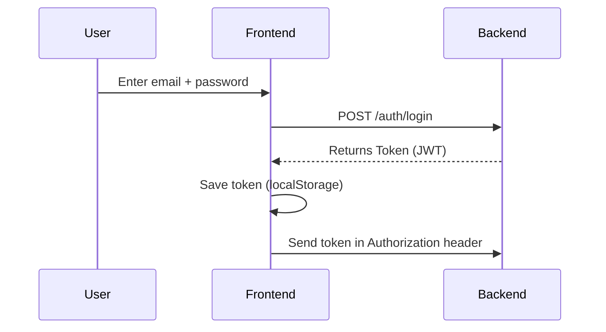
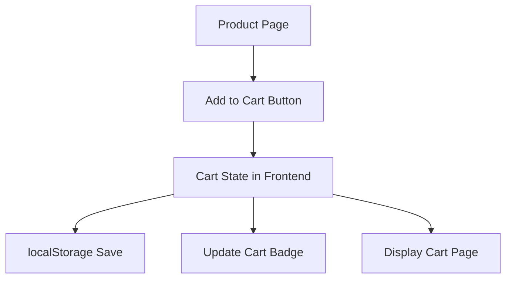
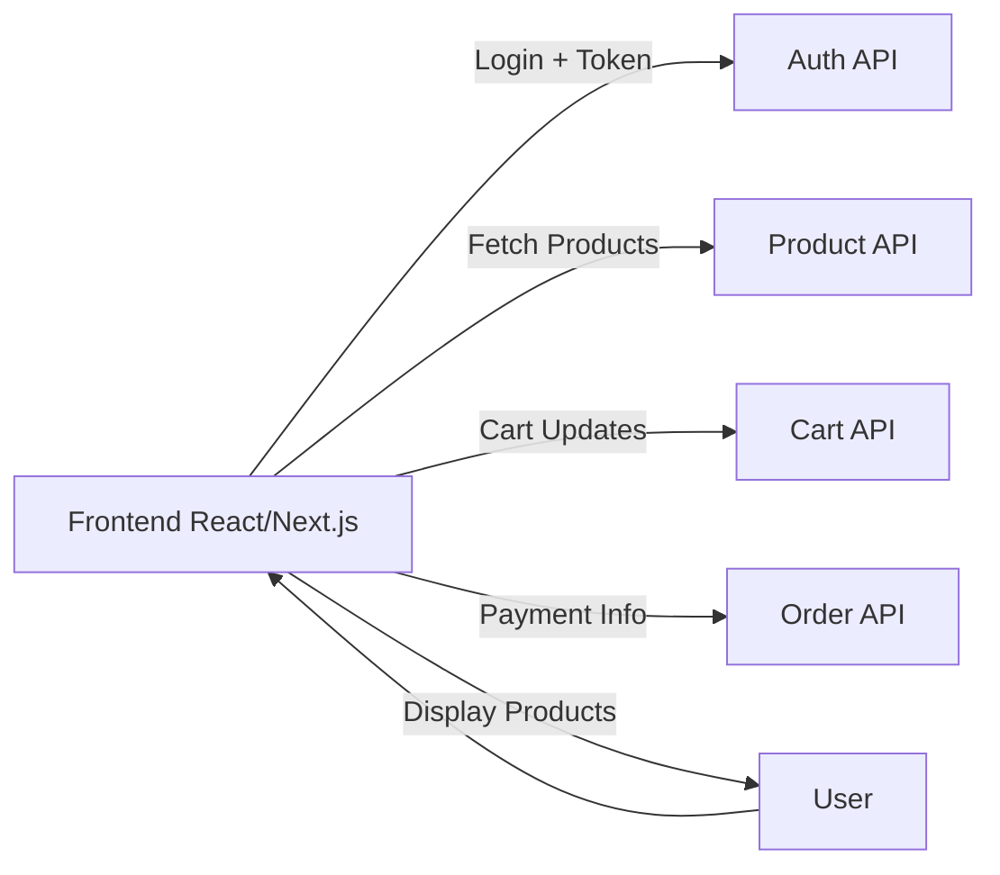

--- 
title: "Frontend for Modern E-commerce (Beginner-Friendly Lecture Slides)"
author: "MIS 279 - E-commerce"
description: "Beginner-friendly lecture slides covering frontend frameworks, SEO, login/auth, tokens, cart management, and essential features."
---

> **NOTE FOR AI (Copilot / Capilot / Slide Generator):**  
> Generate **HTML-based lecture slides** using a clean modern style (Reveal.js recommended),  
> with:
> - Clean syntax-highlighted **code blocks**  
> - **Visual diagrams** (Mermaid) explaining login flow, token flow, request flow, and cart flow  
> - Short bullet points  
> - Clear section breaks  
> - Mobile-friendly layout  
> - Icons/illustrations where helpful  
> - Avoid clutter — keep it beginner-friendly  

---

# 🌟 Frontend Web Development for Modern E-commerce  
### *Beginner-Friendly Lecture Slides*

---

# 🧱 Slide 1 — What is the Frontend?

The **frontend** is everything the customer sees and interacts with:

- Homepage  
- Product pages  
- Categories  
- Search bar  
- Cart page  
- Login & Register  
- Checkout  
- User profile  

Example screenshot references:  
- Amazon product page  
- Shopify theme homepage  

---

# 🌐 Slide 2 — Choosing a Framework

### Beginner-Friendly Framework Options:
- **React** — most popular  
- **Next.js** — React + SEO built-in  
- **Vue** — simple and clean  
- **Plain HTML/CSS/JS** — great for foundations  

### Recommendation for Students:
➡ Use **React** or **Next.js** for the project.

---

# 🔍 Slide 3 — SEO Basics (Simple & Practical)

### What is SEO?
> “How Google finds your store and shows your products.”

### Basic SEO rules:
- Good **page titles**
- Good **meta descriptions**
- **Alt text** for images
- **Fast loading** pages  
- **Clear page structure** (H1, H2, etc.)

### Example:
```html
<title>Nike Air Max 90 – Online Store</title>
<meta name="description" content="Buy Nike Air Max 90 with fast delivery.">

```

---

# 🧱 Slide 4 — SEO for E-commerce

### Skills needed:
- Product titles with keywords  
- Search-friendly URLs  
- Lazy loading images  
- Using `<head>` properly  
- Product structured data (JSON-LD)

---

# 🔒 Slide 5 — Login & Signup (Beginner Version)

### Why Login is Needed:
- Save user cart  
- Track orders  
- Store delivery addresses  
- Save wishlists  

### Login form must include:
- Email  
- Password  
- “Remember me” (optional)

---

# 🔑 Slide 6 — What is a Token?

### Simple Explanation:
> A **token** is like a digital ticket proving the user is logged in.

### Example token:
```
eyJhbGciOiJIUzI1NiIsInR5cCI6IkpXVCJ9...
```

### Store it on frontend:
```js
localStorage.setItem("token", data.token);
```

---

# 🔄 Slide 7 — Login Flow (Visual Diagram)



---

# 🧠 Slide 8 — Login State Management

### How frontend remembers the user:
- **localStorage**
- **React Context**
- **Redux / Zustand**
- **Cookies (advanced option)**

Example check:
```js
const token = localStorage.getItem("token");
if (token) showUserMenu();
```

---

# 🛒 Slide 9 — Introduction to Shopping Cart

> The cart is just a **list of items** the user wants to buy.

### Cart Features:
- Add item  
- Remove item  
- Change quantity  
- Save cart between refreshes  
- Show summary  

### Simple example:
```js
let cart = [];

function addToCart(product) {
  cart.push({...product, qty: 1});
  localStorage.setItem("cart", JSON.stringify(cart));
}
```

---

# 🧺 Slide 10 — Cart Flow Diagram



---

# 💡 Slide 11 — Additional Essential Features (Not Mentioned Before)

### Must-have frontend features for real stores:
- Product Search  
- Filters (price, brand, rating)  
- Sorting (newest, price low → high)  
- Wishlist (❤️ button)  
- Product gallery & zoom  
- Reviews & ratings  
- Responsive design  
- Loading indicators  
- Error messages  
- Related products  

---

# 🔎 Slide 12 — Search & Filter (Beginner Example)

Simple search:
```js
const results = products.filter(p => 
  p.title.toLowerCase().includes(searchText.toLowerCase())
);
```

Simple sorting:
```js
products.sort((a,b) => a.price - b.price);
```

---

# ❤️ Slide 13 — Wishlist

Simple wishlist logic:
```js
let wishlist = [];

function addToWishlist(id) {
  wishlist.push(id);
  localStorage.setItem("wishlist", JSON.stringify(wishlist));
}
```

---

# 📱 Slide 14 — Responsive Design (Mobile Friendly)

Simple CSS rule:
```css
img { max-width: 100%; }
```

Show examples of good vs. bad mobile layouts.

---

# 🧩 Slide 15 — Full Frontend Architecture Overview (Diagram)



---

# 🧪 Slide 16 — Lab 1: Product Page

Students build:
- Title  
- Description  
- Price  
- Add to Cart button  
- SEO tags  

---

# 🔐 Slide 17 — Lab 2: Login Form

Steps:
- Simple form  
- Send login request  
- Save token  
- Show logged-in state  

---

# 🛒 Slide 18 — Lab 3: Shopping Cart

Steps:
- Add item  
- Remove item  
- Save in localStorage  
- Show badge in navbar  

---

# 🔍 Slide 19 — Lab 4: Search Bar

Build a simple product search component.

---

# ❤️ Slide 20 — Lab 5: Wishlist

Build a product “heart” button that saves to localStorage.

---

# 🎯 Final Slide — Summary

Students learn how to build:
- SEO-friendly pages  
- Login & signup forms  
- Token-based authentication  
- Shopping cart system  
- Search, filters, wishlist  
- Responsive UI  
- Complete frontend architecture  

---

# 📌 PROMPT FOR AI TO GENERATE HTML LECTURE SLIDES

Copy/paste this prompt when generating HTML slides:

```
Generate a full HTML slide deck (Reveal.js preferred) using the following Markdown as the source content. Use:

- Clean slide theme
- Large headings
- Soft color palette
- Syntax-highlighted code blocks
- Mermaid diagrams (enabled)
- Responsive layout
- Icons or illustrations where helpful

Requirements:
- Every major topic should be one slide
- Keep text beginner-friendly
- Place code samples in clean <pre><code> blocks
- Render diagrams clearly
- Add slide separators (---)
- Avoid crowding: 6–7 bullets per slide max

Produce final output as a standalone HTML file ready to open in a browser.
```

---

