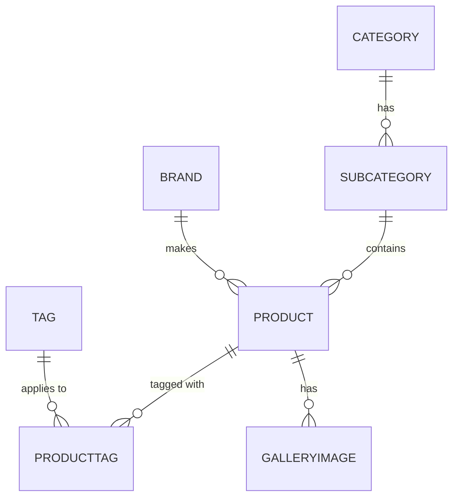

> **Production Note (for Copilot/Copitol/Slide Generator):**  
> - Generate **six decks** (Deck 5.1, 5.2, 6.1, 6.2, 7.1, 7.2) as **separate HTML slide files**.  
> - Use a clean, modern style; code syntax highlighting; and **Mermaid** for diagrams.  
> - Each slide set includes **speaker notes**, **hands-on steps**, and **seed data/code**.  
> - Add subtle illustrations/icons where indicated (architecture, security, product catalog).  
> - Keep type large and accessible; prefer bullets over paragraphs; include recap slides.

---

# Week 5 — APIs & Backend Fundamentals

## Deck 5.1 — Understanding REST APIs & Node.js

### Slide: Title & Outcomes
- **Title:** Understanding REST APIs & Node.js
- **Outcomes:**
  - Explain client–server–database roles
  - Describe REST conventions and HTTP verbs
  - Read JSON responses and status codes
  - Recognize Node.js + Express architecture
::: notes
Bridge DB work (Weeks 3–4) to dynamic APIs. Keep focus on mental model before coding.
:::

---

### Slide: The Big Picture (Architecture)
```mermaid
flowchart LR
  A[Browser / Frontend] -- HTTP/JSON --> B[Express API (Node.js)]
  B -- queries --> C[(MSSQL Database)]
  B -- JSON --> A
  subgraph Server
    B
    C
  end
```
- **Key Path:** Request → Route → Controller → DB → Response
- Stateless, resource-based interactions.
::: notes
Emphasize separation of concerns: frontend shows; API decides; DB persists.
:::

---

### Slide: What Is an API?
- Resource-oriented URLs (nouns): `/products`, `/orders`, `/users`
- HTTP methods: **GET**, **POST**, **PUT**, **DELETE**
- Response format: **JSON** + **status codes**
- Example:
  - `GET /products`
  - `POST /orders`
  - `GET /products/42`
::: notes
E-commerce map: product, cart, order, payment, user auth.
:::

---

### Slide: REST Principles
- Uniform interface
- Stateless requests
- Layered system
- Cacheable responses (where appropriate)
- Consistent resource schemas
::: notes
Ask: Why must `/orders/15` always return the same shape?
:::

---

### Slide: HTTP Status Codes Cheat Sheet
- 200 OK, 201 Created
- 400 Bad Request, 401 Unauthorized, 403 Forbidden
- 404 Not Found
- 500 Server Error
::: notes
Encourage using precise codes; avoids “everything is 200” anti-pattern.
:::

---

### Slide: Node.js & Express Basics
- V8 engine, event loop, non-blocking I/O
- npm ecosystem
- **Express**: minimal routing, middleware
- Typical structure:
```
project/
  server.js
  routes/
  controllers/
  db/
  .env
```
::: notes
Keep files short; move SQL to model/service layer.
:::

---

### Slide: DB Connection (MSSQL)
```js
// db/config.js
import sql from "mssql";
import dotenv from "dotenv";
dotenv.config();

const dbConfig = {
  user: process.env.DB_USER,
  password: process.env.DB_PASS,
  server: process.env.DB_SERVER,
  database: process.env.DB_NAME,
  options: { encrypt: true, trustServerCertificate: true }
};

export const pool = await sql.connect(dbConfig);
export { sql };
```
::: notes
Use environment variables; never hardcode secrets.
:::

---

### Slide: Sample Query (Controller)
```js
// controllers/products.js
import { pool } from "../db/config.js";

export async function listProducts(req, res) {
  const result = await pool.request().query("SELECT * FROM Products");
  res.status(200).json(result.recordset);
}
```
::: notes
Return arrays for list endpoints; objects for single resources.
:::

---

### Slide: Seed SQL (Starter Data)
```sql
-- seeds/products.sql
INSERT INTO Products (Title, Price, Quantity)
VALUES ('Laptop 15\"', 899.99, 12),
       ('Wireless Mouse', 24.50, 100),
       ('USB-C Hub 7-in-1', 39.00, 50);
```
::: notes
Small, realistic sample helps testing pagination and filtering.
:::

---

### Slide: Mini-Exercise (Hands-on)
- **Goal:** Confirm API → DB flow works
1) Create `GET /products` route  
2) Connect to MSSQL and run query  
3) Test with Postman; screenshot JSON  
**Deliverable:** Postman result + code snippet
::: notes
Walk the room; ensure env variables are set and DB reachable.
:::

---

## Deck 5.2 — Building Your First API (Hands-on)

### Slide: Project Setup
- Init & deps:
```bash
npm init -y
npm i express mssql dotenv cors
npm i -D nodemon
```
- `package.json`: `"start": "nodemon server.js"`
::: notes
If Windows + MSSQL local, confirm SQL Server Browser/ports are open.
:::

---

### Slide: Minimal Server
```js
// server.js
import express from "express";
import cors from "cors";
import { listProducts } from "./controllers/products.js";

const app = express();
app.use(cors());
app.use(express.json());

app.get("/products", listProducts);
app.listen(4000, () => console.log("API on http://localhost:4000"));
```
::: notes
Keep the first success moment fast.
:::

---

### Slide: Create (POST) Endpoint
```js
import { pool, sql } from "../db/config.js";

export async function createProduct(req, res) {
  const { title, price, quantity } = req.body;
  await pool.request()
    .input("t", sql.NVarChar, title)
    .input("p", sql.Decimal(10,2), price)
    .input("q", sql.Int, quantity)
    .query("INSERT INTO Products(Title,Price,Quantity) VALUES(@t,@p,@q)");
  res.status(201).json({ message: "Created" });
}
```
::: notes
Parameterize queries to prevent injection.
:::

---

### Slide: Update & Delete (PUT/DELETE)
```js
export async function updateProduct(req, res) {
  const id = +req.params.id;
  const { title, price, quantity } = req.body;
  await pool.request()
    .input("id", sql.Int, id)
    .input("t", sql.NVarChar, title)
    .input("p", sql.Decimal(10,2), price)
    .input("q", sql.Int, quantity)
    .query("UPDATE Products SET Title=@t, Price=@p, Quantity=@q WHERE Id=@id");
  res.json({ message: "Updated" });
}

export async function deleteProduct(req, res) {
  const id = +req.params.id;
  await pool.request().input("id", sql.Int, id)
    .query("DELETE FROM Products WHERE Id=@id");
  res.json({ message: "Deleted" });
}
```
::: notes
Return 404 if affectedRows=0 (extend as exercise).
:::

---

### Slide: Postman Tests (Hands-on)
- **GET** `/products`
- **POST** `/products` (JSON body)
- **PUT** `/products/:id`
- **DELETE** `/products/:id`
**Deliverable:** Export Postman collection.
::: notes
Encourage naming requests with verbs and expected codes.
:::

---

# Week 6 — Authentication & Security

## Deck 6.1 — Security Concepts in E-commerce

### Slide: Threat Landscape
- SQL Injection, XSS, CSRF, brute force, credential stuffing
- Least privilege & secure-by-default
::: notes
Real incidents: data leaks from plaintext passwords; emphasize hashing.
:::

---

### Slide: Injection Example
```sql
SELECT * FROM Users
WHERE Email = 'a@b.com' AND Password = '' OR '1'='1';
```
**Fix:** Parameterized statements, input validation.
::: notes
Show how `' OR '1'='1` changes logic.
:::

---

### Slide: Password Security
- Hash (bcrypt/scrypt/argon2) vs encryption
- Salted, slow hashing
- Never store plaintext
::: notes
Hashing demo next deck.
:::

---

### Slide: JWT & Roles
- JWT = Header.Payload.Signature
- Roles: Admin, Customer
- Store tokens client-side (header `Authorization: Bearer <token>`)
::: notes
Token expiry, refresh strategies (mention briefly).
:::

---

### Slide: HTTPS & Secrets
- TLS for transport security
- `.env` for secrets; do not commit
- Rotate keys periodically
::: notes
Link to institution’s password policy if any.
:::

---

### Slide: Quick Audit (Hands-on)
- List data to **never** log/store (full cards, CVV, plaintext passwords)
- Review DB users/roles; minimize permissions
::: notes
Prompt groups to share 2 risky defaults they’ve used before.
:::

---

## Deck 6.2 — Implementing Auth in Node.js (Hands-on)

### Slide: Install & User Table
```bash
npm i bcrypt jsonwebtoken
```
```sql
CREATE TABLE Users(
  Id INT IDENTITY PRIMARY KEY,
  FirstName NVARCHAR(50),
  Email NVARCHAR(100) UNIQUE NOT NULL,
  Password NVARCHAR(200) NOT NULL,
  RoleId INT NOT NULL DEFAULT 2 -- 1=Admin, 2=Customer
);
CREATE TABLE Roles(Id INT IDENTITY PRIMARY KEY, Name NVARCHAR(30));
INSERT INTO Roles(Name) VALUES ('Admin'),('Customer');
```
::: notes
Add a unique constraint on Email to prevent duplicates.
:::

---

### Slide: Signup Route
```js
import bcrypt from "bcrypt";

app.post("/auth/signup", async (req, res) => {
  const { FirstName, Email, Password } = req.body;
  const hash = await bcrypt.hash(Password, 10);
  await pool.request()
    .input("n", sql.NVarChar, FirstName)
    .input("e", sql.NVarChar, Email)
    .input("p", sql.NVarChar, hash)
    .query("INSERT INTO Users(FirstName,Email,Password) VALUES(@n,@e,@p)");
  res.status(201).json({ message: "User created" });
});
```
::: notes
Return 409 if email exists (exercise).
:::

---

### Slide: Login Route + JWT
```js
import jwt from "jsonwebtoken";

app.post("/auth/login", async (req, res) => {
  const { Email, Password } = req.body;
  const r = await pool.request().input("e", sql.NVarChar, Email)
    .query("SELECT * FROM Users WHERE Email=@e");
  const user = r.recordset[0];
  if (!user) return res.status(401).json({ msg: "Invalid" });
  const ok = await bcrypt.compare(Password, user.Password);
  if (!ok) return res.status(401).json({ msg: "Invalid" });
  const token = jwt.sign(
    { id: user.Id, role: user.RoleId },
    process.env.JWT_SECRET,
    { expiresIn: "2h" }
  );
  res.json({ token });
});
```
::: notes
Use short expiries in dev; refresh later if needed.
:::

---

### Slide: Auth Middleware
```js
function verify(req, res, next) {
  const h = req.headers["authorization"];
  if (!h) return res.sendStatus(401);
  const [, token] = h.split(" ");
  try {
    req.user = jwt.verify(token, process.env.JWT_SECRET);
    next();
  } catch {
    res.sendStatus(401);
  }
}
```
::: notes
Add role checks in a separate middleware (exercise).
:::

---

### Slide: Protected Routes (Hands-on)
```js
app.get("/orders", verify, async (req, res) => {
  // Only authenticated users can see their orders
  const r = await pool.request()
    .input("uid", sql.Int, req.user.id)
    .query("SELECT * FROM Orders WHERE CustomerId=@uid");
  res.json(r.recordset);
});
```
**Test:** Login → copy token → set `Authorization: Bearer <token>` in Postman.
::: notes
Have students demo a 401 → then a 200 after adding header.
:::

---

# Week 7 — Product & Catalog Management

## Deck 7.1 — Designing Product Structures

### Slide: Core Tables & Relations
- **Product**, **Category**, **SubCategory**, **Brand**, **Tag**, **ProductTag**, **Gallery**  
- Many-to-many via junctions; images in separate table

::: notes
Encourage extensibility: variants, attributes, SKUs later.
:::

---

### Slide: Seed SQL (Catalog)
```sql
INSERT INTO Category(Title) VALUES('Electronics'),('Home');
INSERT INTO SubCategory(Title,CategoryId) VALUES('TV & Audio',1),('Small Appliances',2);
INSERT INTO Brand(Title) VALUES('Sony'),('LG'),('Philips');
INSERT INTO Product(Title,Price,Quantity,BrandId,CategoryId)
VALUES('Smart TV 55\"',699.99,10,1,1),
      ('Soundbar 2.1',149.00,25,2,1),
      ('Vacuum Cleaner',89.00,20,3,2);
INSERT INTO Tags(Title) VALUES('New'),('Sale'),('Bestseller');
```
::: notes
Add indexes on foreign keys for performance.
:::

---

### Slide: Product Query (Join)
```sql
SELECT p.Id, p.Title, p.Price,
       b.Title AS Brand, c.Title AS Category
FROM Product p
JOIN Brand b ON p.BrandId = b.Id
JOIN Category c ON p.CategoryId = c.Id
ORDER BY p.Id DESC;
```
::: notes
Use this for listing API; add pagination later.
:::

---

### Slide: Admin vs Customer Views
- Admin needs: CRUD, inventory, discount management
- Customer needs: discovery, search, filters, reviews (later)
::: notes
Discuss search strategies: DB LIKE vs external search later.
:::

---

## Deck 7.2 — Building the Product Module (Hands-on)

### Slide: Endpoints
- `GET /products` (with join + pagination)
- `GET /products/:id`
- `POST /products` (validated)
- `PUT /products/:id`
- `DELETE /products/:id`
::: notes
Return 201 on create; 204 on delete (optional); 404 on not found.
:::

---

### Slide: List Products (Controller)
```js
app.get("/products", async (req, res) => {
  const page = +(req.query.page ?? 1);
  const limit = +(req.query.limit ?? 10);
  const offset = (page - 1) * limit;
  const q = `
    SELECT p.Id,p.Title,p.Price,p.Quantity,
           b.Title AS Brand,c.Title AS Category
    FROM Product p
    JOIN Brand b ON p.BrandId=b.Id
    JOIN Category c ON p.CategoryId=c.Id
    ORDER BY p.Id DESC
    OFFSET ${offset} ROWS FETCH NEXT ${limit} ROWS ONLY`;
  const r = await pool.request().query(q);
  res.json({ page, limit, items: r.recordset });
});
```
::: notes
Optionally add a separate COUNT query to compute total pages.
:::

---

### Slide: Create Product (Validation)
```js
import Joi from "joi"; // npm i joi
const schema = Joi.object({
  title: Joi.string().min(2).required(),
  price: Joi.number().min(0).required(),
  quantity: Joi.number().integer().min(0).required(),
  brandId: Joi.number().integer().required(),
  categoryId: Joi.number().integer().required()
});

app.post("/products", async (req,res)=>{
  const v = schema.validate(req.body);
  if (v.error) return res.status(400).json({ error: v.error.message });
  const { title, price, quantity, brandId, categoryId } = req.body;
  await pool.request()
    .input("t", sql.NVarChar, title)
    .input("p", sql.Decimal(10,2), price)
    .input("q", sql.Int, quantity)
    .input("b", sql.Int, brandId)
    .input("c", sql.Int, categoryId)
    .query(`INSERT INTO Product(Title,Price,Quantity,BrandId,CategoryId)
            VALUES(@t,@p,@q,@b,@c)`);
  res.status(201).json({ message: "Created" });
});
```
::: notes
Show one invalid payload and resulting 400 in Postman.
:::

---

### Slide: File Upload (Images)
```js
import multer from "multer";
const upload = multer({ dest: "uploads/" });

app.post("/products/:id/image", upload.single("image"), (req,res)=>{
  // Save req.file.filename to GalleryImage table with product id
  res.json({ uploaded: true, file: req.file });
});
```
::: notes
Discuss production storage (cloud/object storage) later.
:::

---

### Slide: Simple Admin Form → API
```html
<form id="addForm">
  <input name="title" placeholder="Title" required />
  <input name="price" type="number" step="0.01" required />
  <input name="quantity" type="number" required />
  <button>Add</button>
</form>
<script>
document.querySelector('#addForm').onsubmit = async (e) => {
  e.preventDefault();
  const body = {
    title: e.target.title.value,
    price: +e.target.price.value,
    quantity: +e.target.quantity.value,
    brandId: 1, categoryId: 1
  };
  await fetch('/products', {
    method: 'POST',
    headers: {'Content-Type':'application/json'},
    body: JSON.stringify(body)
  });
  alert('Product added');
};
</script>
```
::: notes
If using a separate frontend origin, enable CORS in the API.
:::

---

### Slide: Hands-on Checklist (Deliverables)
- Products CRUD working with validation
- Pagination & join query in list endpoint
- Postman collection exported
- Optional: image upload route + admin form
**Submission:** GitHub repo link + short README
::: notes
Close the loop with a commit-and-push checkpoint.
:::

---

# Appendix — Seeds & Fixtures

### MSSQL Quick Seeds
```sql
-- Roles
INSERT INTO Roles(Name) VALUES ('Admin'),('Customer');
-- Users (one admin placeholder; set hashed password from app flow)
INSERT INTO Users(FirstName, Email, Password, RoleId)
VALUES ('Admin','admin@example.com','<hash>',1);

-- Catalog
INSERT INTO Category(Title) VALUES('Electronics'),('Home');
INSERT INTO SubCategory(Title,CategoryId) VALUES('TV & Audio',1),('Small Appliances',2);
INSERT INTO Brand(Title) VALUES('Sony'),('LG'),('Philips');
INSERT INTO Product(Title,Price,Quantity,BrandId,CategoryId)
VALUES('Smart TV 55\"',699.99,10,1,1),
      ('Soundbar 2.1',149.00,25,2,1),
      ('Vacuum Cleaner',89.00,20,3,2);

-- Tags
INSERT INTO Tags(Title) VALUES('New'),('Sale'),('Bestseller');
```

### Postman Smoke Tests
- `GET /products` → 200
- `POST /products` (valid) → 201
- `POST /products` (invalid) → 400
- `PUT /products/:id` → 200
- `DELETE /products/:id` → 200/204
- `POST /auth/signup` → 201
- `POST /auth/login` → 200 {token}
- `GET /orders` (no token) → 401; (with token) → 200

### Visual Suggestions
- Icons: server/database/lock/cart
- Architecture diagram (Mermaid) where indicated
- Security slide: shield/lock illustrations
- Product module: cards showing product image/title/price

### Style Guide
- Keep code legible (14–16pt monospace)
- 5–7 bullets per slide max
- Consistent color accents (blue/green) for actions vs warnings
- Use speaker notes blocks for instructor guidance
